# 🎮 GitBreaker

> **Smash your GitHub contributions** — A brick breaker game where every brick is a day from your contribution heatmap.

<div align="center">



### ▶️ [Play the Game](https://anoojshete.github.io/gitbreaker/game/)

</div>

---

## ✨ What is this?

GitBreaker transforms your GitHub contribution graph into a **playable brick breaker game**. Each brick represents a day of contributions:

| Contributions | Brick HP | Color |
|---|---|---|
| None | — | No brick |
| 1–3 / day | 1 HP | `#0e4429` Dark green |
| 4–7 / day | 2 HP | `#006d32` Medium green |
| 8–12 / day | 3 HP | `#26a641` Bright green |
| 13+ / day | 4 HP | `#39d353` Neon green ✨ |

The animated SVG above auto-updates daily via GitHub Actions.

---

## 🕹️ Features

### Playable Game
- 🎯 **Real contribution data** — Enter any GitHub username to play their heatmap
- 🏓 **Smooth controls** — Mouse, keyboard (WASD/arrows), and touch support
- 💥 **Power-ups** — Multi-ball, wide paddle, laser, slow ball
- ✨ **Particle effects** — Brick explosions, ball trail, sparkle bursts
- 🔊 **Synthesized audio** — Procedural sound effects (no files needed)
- 📱 **Responsive** — Works on mobile, tablet, and desktop
- 🎨 **Neon aesthetic** — Dark theme with glow effects

### SVG Animation
- 🎬 **Auto-playing** — Simulated gameplay in your README
- 🤖 **AI paddle** — Deterministic simulation for consistent animations
- 🎨 **CSS-only animation** — No JavaScript, works everywhere SVGs are displayed
- ♿ **Accessible** — Respects `prefers-reduced-motion`

### Automation
- ⚙️ **Daily updates** — GitHub Actions fetches your latest contributions
- 🔄 **Auto-commit** — SVG regenerates and commits automatically
- 🛡️ **Fallback** — Demo grid if API is unavailable

---

## 🏗️ Architecture

```
gitbreaker/
├── game/                      # 🕹️ Playable web game
│   ├── index.html             # Entry point
│   ├── css/style.css          # Neon dark theme
│   └── js/
│       ├── main.js            # Game loop + state machine
│       ├── ball.js            # Ball physics + trail
│       ├── paddle.js          # Input handling + smooth movement
│       ├── brick.js           # HP system + visual effects
│       ├── grid.js            # Contribution → brick grid mapping
│       ├── collision.js       # AABB collision detection
│       ├── powerups.js        # Power-up system (4 types)
│       ├── particles.js       # Object-pooled particle engine
│       ├── sound.js           # Web Audio API synthesizer
│       ├── contributions.js   # GitHub API client
│       └── ui.js              # HUD + screen management
│
├── generator/                 # 🎬 SVG animation generator
│   ├── generate.js            # Orchestrator
│   ├── fetch-contributions.js # GitHub GraphQL API
│   ├── simulate.js            # Deterministic game simulation
│   └── render-svg.js          # CSS @keyframes SVG renderer
│
├── output/
│   └── game.svg               # 📊 Generated animation
│
├── .github/workflows/
│   └── generate.yml           # ⏰ Daily cron job
│
└── package.json
```

---

## 🚀 Setup

### Play Locally

1. Clone the repo
2. Open `game/index.html` in your browser — or serve it:
   ```bash
   npx http-server game -p 8080
   ```
3. Enter a GitHub username and play!

### Enable Daily SVG Updates

1. Create a [GitHub Personal Access Token](https://github.com/settings/tokens) with `read:user` scope
2. Add it as a repository secret named `GH_PAT`
3. Set a repository variable `GITHUB_USERNAME` to your GitHub handle
4. Go to **Settings → Actions → General → Workflow permissions** → select **Read and write permissions**
5. The SVG will auto-update daily at midnight UTC

### Generate SVG Manually

```bash
GITHUB_TOKEN=ghp_xxx GITHUB_USERNAME=anoojshete node generator/generate.js
```

---

## 🛠️ Tech Stack

| Component | Technology |
|---|---|
| Game engine | HTML5 Canvas + Vanilla JavaScript (ES6 modules) |
| Styling | Vanilla CSS with custom properties |
| Audio | Web Audio API (procedural synthesis) |
| SVG Animation | CSS `@keyframes` (no JS) |
| API | GitHub GraphQL API |
| Automation | GitHub Actions (cron) |
| Deployment | GitHub Pages |

**Zero dependencies** — no npm packages, no build step, no framework.

---

## 📜 License

MIT © [anoojshete](https://github.com/anoojshete)
